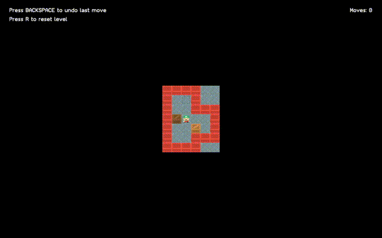

Rustoban
========

This is a small private project in an attempt to learn Rust. I'm planning on cloning
many more simple games like this and hopefully improve over time.

With that being said, please keep in mind that this program was written by an amateur
programmer and could certainly be improved in many ways.

Levels
------
The game comes with a set of 155 levels, but you can easily swap them out for your own.
Check the levels.txt file in the resources folder! The syntax is as follows:

| Character | Level Element          |
| --------- | ---------------------- |
| #         | Wall                   |
| ' '       | Empty floor tile       |
| .         | Empty storage tile     |
| @         | Player                 |
| +         | Player on storage tile |
| $         | Box                    |
| *         | Box on storage tile    |

Resources
---------
Levels made by [David Skinner](http://abelmartin.com/rj/sokobanJS/Skinner/David%20W.%20Skinner%20-%20Sokoban.htm)

Graphics made by [Kenney](https://kenney.nl)